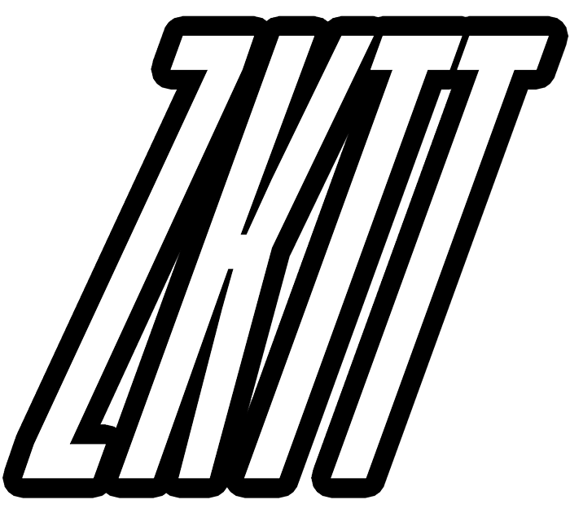

<a href="https://zktable.top"></a>

[](https://github.com/webisoftSoftware/zktt/actions/workflows/test.yaml)

## zKTT - Cairo Contracts

### Instructions to run locally:

#### Terminal #1 (Make sure this is running)

```bash
# Run Katana
katana --disable-fee --allowed-origins "*"
```

#### Terminal #2

```bash
# Build the contracts
sozo build

# Load models and systems onto katana.
sozo migrate apply

# Join with two example accounts.
./join.sh

# Interact with the world and the systems.
sozo execute --world <world-hash> table <system-name> (i.e start)
```

#### Terminal #3
```bash
# Start Torii
torii --world <world-hash> --allowed-origins "*"
```

---
